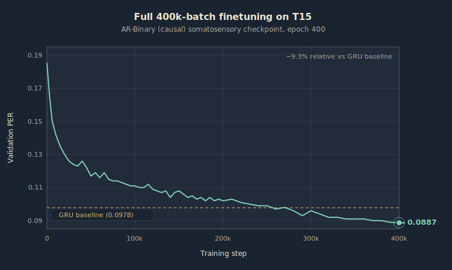
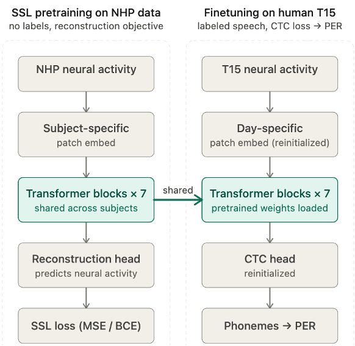

# brain2text-ssl-nhp

**Self-supervised pretraining with non-human-primate intracortical recordings improves human speech-BCI decoding by 9.3 % phoneme error rate.**

[](https://www.python.org/downloads/)
[](LICENSE)




## Summary

The project has two halves: a **competition entry** that produced a strong human-speech-decoding baseline, and a **Master's thesis** that extended it through cross-species self-supervised pretraining.

- **Brain-to-Text '25 competition (encoder side).** Optimized the official 5-layer GRU baseline through learning-rate schedule, speckled masking, training-length and hyperparameter sweeps, bringing T15 validation PER from **≈0.110 → 0.0978** — within the range of leading public submissions, and the encoder against which every later experiment in the thesis is measured.
- **Master's thesis.** Built a 7-block Transformer encoder, then pretrained it with self-supervised learning on **monkey** intracortical recordings only and finetuned for **human** attempted-speech phoneme decoding.
- Roughly **25 pretraining runs** in total — 4 NHP partitions on the GRU, 10 SSL objectives screened on somatosensory with the Transformer, cross-dataset extension of the two best objectives over the 4 NHP partitions, and two architectural ablations of the winner. **Exactly one** of those runs improves on the no-pretraining baseline: **AR-Binary** (dual BCE on binarized spikes, 30 % channel masking, causal attention) pretrained on the **10-hour Chowdhury 2020 macaque somatosensory (Area 2 / S1)** dataset.
- That configuration brings T15 PER from 0.0978 to **0.0887**, a 9.3 % relative improvement, and transfers (−2.5 % relative) to T12 (Brain-to-Text '24) without retraining the SSL stage.
- Motor cortex pretraining is neutral-to-harmful across all 6 cells of the cross-dataset grid; this work isolates the cortical-region axis that BIT's mixed pretraining pooled together.


## Background

Intracortical speech brain-computer interfaces decode attempted speech from
microelectrode arrays implanted in speech motor cortex. Recent work
(Willett et al., 2023; Card et al., 2024) reaches word error rates between
9 % and 24 % on large-vocabulary attempted-speech tasks — a fourfold
improvement over ECoG-based systems, but still far from accuracies that
would make speech BCIs a routinely-deployable communication device.

A central obstacle is **data scarcity**: a typical human intracortical BCI
corpus contains a few thousand labelled sentences from a single participant,
orders of magnitude less than is routine in adjacent fields. The leading
public work on closing this gap, **BIT** (Zhang & He et al., 2025), pairs a
Transformer encoder with masked-reconstruction self-supervised pretraining
on a mixed corpus of human (98 h) and non-human-primate (269 h) Utah-array
recordings. BIT shows that adding NHP pretraining on top of human pretraining
helps; what it does *not* answer is whether NHP data alone produces any
improvement at all, which NHP dataset is responsible, and which SSL objective
captures the transfer.

This work answers those three questions.


## Methodology



The pipeline is the standard cascade for intracortical speech BCIs: a
neural encoder produces phoneme logits, supervised with CTC. We hold the
downstream finetuning recipe fixed (TFS baseline = 0.097 PER on T15) and
vary the SSL pretraining axis. Pretraining loss does not predict downstream
PER (the contrastive objective minimises its InfoNCE loss efficiently but
its checkpoint collapses the downstream finetuning entirely); we therefore
select checkpoints via a **monitoring protocol** that runs a short 30k-batch
finetuning of each saved checkpoint on T15 and reports the actual validation
PER. Across the 10 objectives screened on somatosensory, AR-Binary
(causal, dual loss) is the only one whose monitoring PER lands below the
no-SSL baseline of 0.124. Full architectural and methodological details:
[docs/architecture.md](docs/architecture.md).


## Contributions

### Engineering: optimized GRU baseline for Brain-to-Text '25 (Chapter 5)

- Starting from the official 5-layer GRU baseline distributed with the
  Brain-to-Text '25 competition (~0.110 validation PER on T15 with default
  config and 100k batches), explored configurations along several axes:
  **learning-rate scheduler** (linear vs step vs cosine — cosine won),
  **speckled input masking** (per-channel coordinated dropout, adopted from
  the Brain-to-Text '24 lessons-learned report), **training-schedule length**
  (extended to 120k batches with no overfitting signal), **xLSTM as recurrent
  core** (did not match the optimized GRU), and **post-GRU residual heads**
  (marginal, dropped). A manual hyperparameter sweep over learning rate,
  weight decay, input dropout, batch size, GRU depth/width, and the patch
  kernel/stride completed the picture.
- The final configuration — `lr_max = 4e-3` cosine with warmup, speckled
  mask probability 0.2, input dropout 0.2, batch size 32, 120k batches,
  5 unidirectional GRU layers × 768 units, kernel 14 / stride 4, CTC loss
  over 41 classes — reaches **T15 validation PER 0.0978**, an ~11 % relative
  improvement over the released baseline and within the range of leading
  public submissions.
- The full sweep configurations live under
  [`configs/archive/earliest/01_brain2text25/`](configs/archive/earliest/01_brain2text25/);
  the canonical winning config is
  [`configs/baselines/gru_baseline.yaml`](configs/baselines/gru_baseline.yaml).

### Research: cross-species SSL extension (Master's thesis)

- **Headline.** AR-Binary (causal) + Chowdhury 2020 S1 (10 h) finetuned on
  T15 reaches **PER = 0.0887** — a 9.3 % relative improvement over the
  optimised GRU baseline (0.0978) and 8.6 % over the matched TFS Transformer
  baseline (0.097).
- **Cross-participant generalization.** The same pretrained checkpoint
  finetuned on T12 (Brain-to-Text '24, a different participant) reduces
  PER by **−2.5 % relative** (3 seeds, no overlap between SSL and control).
- **Representational signature.** Canonical correlation analysis of the
  encoder's final-block embeddings shows **+18.3 % cross-session alignment
  within T15** and **+11.2 % cross-brain alignment between T12 and T15**
  for the SSL-pretrained encoder over the no-SSL alternative — the SSL
  representation is session- and brain-invariant in a measurable sense.
- **Motor-cortex-poison.** Of six motor-cortex pretraining cells (3
  partitions × 2 leading objectives), none improves on the no-SSL baseline;
  five are strictly worse. Only the smallest (10 h) and only the
  non-motor (S1) dataset of the grid produces a positive cell. Quantity is
  not the operative variable; representational specificity is.

Full results, tables, and the four-axis validation panel:
[docs/results.md](docs/results.md).


## Repository layout

- [`src/brain2text/`](src/brain2text/) — the library. Submodules: `data/`, `models/`, `ssl/`, `training/`, `evaluation/`, `utils/`.
- [`configs/`](configs/) — YAML configurations, grouped by experimental role: `baselines/`, `ssl_study/`, `grid/`, `ablations/`, `validations/`.
- [`scripts/`](scripts/) — portable CLI launchers (`train.py`, `pretrain.py`, `finetune.py`, `evaluate_cca*.py`, `preprocess_t12.py`, `preprocess_nhp.py`).
- [`docs/`](docs/) — [architecture.md](docs/architecture.md) and [results.md](docs/results.md) cover the methods and the full results panel.
- [`examples/reproduce_headline.md`](examples/reproduce_headline.md) — end-to-end recipe for the PER 0.0887 result.


## Reproducing the headline

End-to-end recipe from preprocessing to the PER 0.0887 number, including
expected GPU-time and CCA evaluations:
[examples/reproduce_headline.md](examples/reproduce_headline.md).

Short version:

```bash
# Set paths
export DATA_DIR=/path/to/data
export CHECKPOINT_DIR=/path/to/checkpoints

# Pretrain
python scripts/pretrain.py --config configs/ssl_study/ar_binary_causal_soma.yaml

python scripts/finetune.py \
    --config configs/validations/multi_seed_t15/ft_seed10.yaml \
    --set model.ssl_checkpoint=${CHECKPOINT_DIR}/ssl_study/ar_binary_soma/epoch_400.pt \
    --set num_training_batches=400000
```


## Datasets

This work uses publicly available datasets only:

- **T15** — Brain-to-Text '25 (Card et al., 2024). 10,948 sentences,
  45 sessions, 256 TX + 256 SBP channels.
- **T12** — Brain-to-Text '24 (Willett et al., 2023). 8,800 train + 880 val
  trials, 24 sessions, same 512-feature structure.
- **NHP corpus (~200 h)** — ten macaque Utah-array releases: Churchland
  et al. (2012), O'Doherty et al. (2017), Perich et al. (2018),
  Even-Chen et al. (2019), Chowdhury et al. (2020) — *the somatosensory
  partition that produces the headline*, NLB MC_Maze / MC_RTT (Pei et al.,
  2021), Ma et al. (2023), FALCON / Karpowicz et al. (2024), LINK / Temmar
  et al. (2025). Sources and per-dataset hours are documented in
  [scripts/preprocess_nhp.py](scripts/preprocess_nhp.py)
  (the `DATASET_REGISTRY`).


## References

- Card, N. S. et al. (2024). *An accurate and rapidly calibrating speech
  neuroprosthesis.* New England Journal of Medicine.
- Chowdhury, R. H., Glaser, J. I., Miller, L. E. (2020). *Area 2 of primary
  somatosensory cortex encodes kinematics of the whole arm.* eLife.
- Gallego, J. A. et al. (2018). *Long-term stability of cortical population
  dynamics underlying consistent behavior.* bioRxiv 447441v3.
- Willett, F. R. et al. (2023). *A high-performance speech neuroprosthesis.*
  Nature.
- Zhang, S., He, B. et al. (2025). *BIT: Brain-to-Text via pretraining on
  intracortical recordings.* Preprint.
- Zhu, R.-J. et al. (2023). *SpikeGPT: Generative pretrained language model
  with spiking neural networks.* Preprint.
