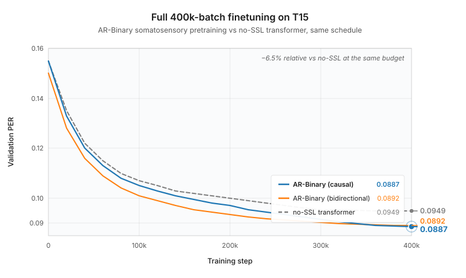
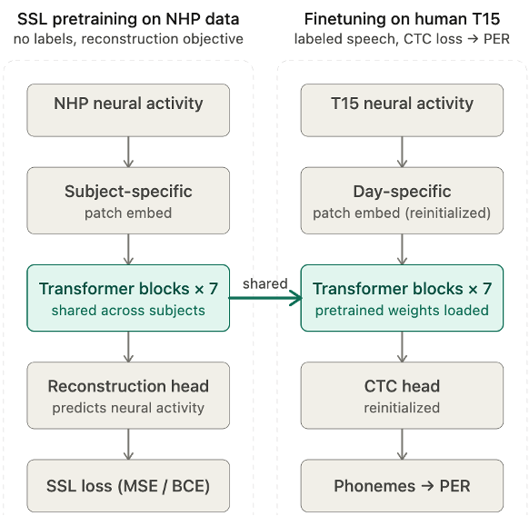

# brain2text-ssl-nhp

**Design and Study of Non-Human Primate Self-Supervised Pretraining Techniques for Human Speech Decoding.**

[](https://www.python.org/downloads/)
[](LICENSE)



> Master's thesis at TU Wien, supervised by Assist. Prof. Guillaume Bellec. Vienna, June 2026.


## Summary

The thesis asks one question: can a human speech decoder be improved by self-supervised pretraining on non-human-primate (NHP) intracortical recordings *alone*? The answer is yes, but narrowly — under one specific pairing of pretraining data and pretraining objective, and only once the encoder is the right kind of network.

The project has two halves: a **competition entry** that produced a strong baseline, and a **Master's thesis** that extended it through cross-species self-supervised pretraining.

- **Brain-to-Text '25 competition (encoder side).** Tuned the official 5-layer GRU baseline through learning-rate schedule, speckled masking, training-length and hyperparameter sweeps, bringing T15 validation PER from **≈0.110 → 0.0976** — within the range of leading public submissions, and the substrate against which every later experiment is measured (Chapter 5).
- **Master's thesis.** Built a 7-block Transformer encoder from scratch (matched the GRU at PER 0.097, Chapter 7), then pretrained it with self-supervised learning on **monkey** intracortical recordings only and finetuned for **human** attempted-speech phoneme decoding.
- Pretraining on **~10 hours of macaque somatosensory cortex** (Chowdhury 2020) with **AR-Binary** — a binarized autoregressive objective with a dual cross-channel + next-step loss — brings T15 PER to **0.0887**, a **6.5 % relative improvement** over a no-SSL transformer trained at the same 400k-batch budget (PER 0.0949). The setting is, to the extent we are aware, unstudied: cross-species pretraining on monkey data alone, without human data in the mixture.


## Research questions

1. Can self-supervised pretraining on non-human-primate intracortical recordings, *alone*, improve the downstream phoneme error rate of a human speech BCI decoder?
2. If a transfer effect exists, what determines it — which cortical region recorded in the monkey, and which self-supervised objective?
3. If a positive combination of region and objective is found, does it generalize across seeds and across participants, and what is the representational signature behind it?


## Methodology



The pipeline is the standard cascade for intracortical speech BCIs: a neural encoder produces phoneme logits, supervised with CTC. The downstream finetuning recipe is held fixed and only the SSL pretraining axis is varied. Two SSL objective families are tested on the transformer across the four NHP partitions of the corpus: masked reconstruction (the BIT recipe) and AR-Binary (causal and bidirectional variants, both with the dual cross-channel + next-step loss). Pretraining loss does not predict downstream PER, so checkpoints are selected through a **monitoring protocol** that runs a short 30k-batch finetuning of each saved checkpoint on T15 and reports the actual validation PER. Full architectural and methodological details: [docs/architecture.md](docs/architecture.md).


## Contributions

**Research.**

- **A human speech decoder improved by pretraining on NHP data alone.** AR-Binary on ~10 h of macaque somatosensory cortex, finetuned on T15, reaches **PER 0.0887** — a 6.5 % relative improvement over a from-scratch transformer at the same 400k-batch budget (0.0949). No human data enters the pretraining stage.
- **A map of what transfers across species.** Across the grid of cortical region × SSL objective, only **somatosensory + AR-Binary** improves the decoder; every motor-cortex partition is neutral or harmful, and the masked-reconstruction objective used by BIT gives no benefit on NHP data alone. This isolates **the cortical region**, not corpus size, as the variable that decides transfer.
- **A mechanistic account, backed by four independent validations.** The improvement reproduces across seeds (PER 0.0925 ± 0.0005 on T15 at 250k batches), transfers to a second participant (−2.5 % relative on T12, no overlap between SSL and control), leaves a session- and brain-invariant representational signature measurable by canonical correlation analysis (+18.3 % within T15, +11.2 % T12 ↔ T15), and behaves as a complementary cortical prior rather than a refinement of pre-existing phonetic structure (a finetune-SSL-finetune pipeline does not improve on SSL → finetune).

**Work and methodology.**

- **A strong, reproducible Brain-to-Text '25 baseline.** Tuning of the official GRU baseline through optimizer, learning-rate schedule and augmentation choices brings T15 validation PER into the range of leading public submissions (Chapter 5), fixing the downstream reference point for the rest of the work. Canonical config: [`configs/baselines/gru_baseline.yaml`](configs/baselines/gru_baseline.yaml); per-axis sweeps under [`configs/archive/earliest/01_brain2text25/`](configs/archive/earliest/01_brain2text25/).
- **A from-scratch transformer encoder matching that baseline.** The BIT transformer was reconstructed from its description and tuned on T15 alone to PER 0.097 (Chapter 7), removing the encoder architecture as a confound for the pretraining experiments. This step was motivated by the negative result that the GRU rejects NHP pretraining outright (Chapter 6).


## Key findings

- **Encoder architecture is decisive.** The same NHP pretraining that harmed the GRU helped the transformer. A recurrent network stores its temporal model in the recurrent weights, so pretraining on foreign dynamics overwrites what finetuning needs; a transformer distributes its temporal model across attention recomputed at each pass, letting pretrained features survive in its residual stream.
- **Data and objective matter independently, and the winning combination is the smallest dataset + the most specialized objective.** Motor-cortex pretraining (~200 h) was neutral or harmful on the transformer, while the 10-hour somatosensory partition was the only one that helped — the *motor-cortex-poison* hypothesis (NHP-specific: it does not contradict BIT, whose mixed corpus includes human speech data anchoring motor-cortex pretraining to the task).
- **The benefit is representational, not reconstructive.** Pretraining loss does not predict downstream PER. What matters is whether the pretraining injects a representational prior that survives finetuning — the somatosensory-pretrained encoder is the one whose representation resists the session-specific specialization that the supervised loss otherwise induces, staying aligned across sessions and across two different brains.

Full results, tables, and the four-axis validation panel: [docs/results.md](docs/results.md).


## Repository layout

- [`src/brain2text/`](src/brain2text/) — the library. Submodules: `data/`, `models/`, `ssl/`, `training/`, `evaluation/`, `utils/`.
- [`configs/`](configs/) — YAML configurations, grouped by experimental role: `baselines/`, `ssl_study/`, `grid/`, `ablations/`, `validations/`.
- [`scripts/`](scripts/) — portable CLI launchers (`train.py`, `pretrain.py`, `finetune.py`, `evaluate_cca*.py`, `preprocess_t12.py`, `preprocess_nhp.py`).
- [`docs/`](docs/) — [architecture.md](docs/architecture.md) and [results.md](docs/results.md) cover the methods and the full results panel.
- [`examples/reproduce_headline.md`](examples/reproduce_headline.md) — end-to-end recipe for the PER 0.0887 result.


## Reproducing the headline

End-to-end recipe in [examples/reproduce_headline.md](examples/reproduce_headline.md). Short version:

```bash
export DATA_DIR=/path/to/data
export CHECKPOINT_DIR=/path/to/checkpoints

# Pretrain
python scripts/pretrain.py --config configs/ssl_study/ar_binary_causal_soma.yaml

# Finetune
python scripts/finetune.py \
    --config configs/validations/multi_seed_t15/ft_seed10.yaml \
    --set model.ssl_checkpoint=${CHECKPOINT_DIR}/ssl_study/ar_binary_soma/epoch_400.pt \
    --set num_training_batches=400000
```


## Datasets

This work uses publicly available datasets only:

- **T15** — Brain-to-Text '25 (Card et al., 2024). 10,948 sentences, 45 sessions, 256 TX + 256 SBP channels.
- **T12** — Brain-to-Text '24 (Willett et al., 2023). 8,800 train + 880 val trials, 24 sessions, same 512-feature structure.
- **NHP corpus (~201 h, 22 subjects, 586 sessions)** — ten macaque Utah-array releases: Churchland et al. (2012), O'Doherty et al. (2017), Perich et al. (2018), Even-Chen et al. (2019), Chowdhury et al. (2020) — *the somatosensory partition that produces the headline*, NLB MC_Maze / MC_RTT (Pei et al., 2021), Ma et al. (2023), FALCON / Karpowicz et al. (2024), LINK / Temmar et al. (2025). Sources and per-dataset hours are documented in [scripts/preprocess_nhp.py](scripts/preprocess_nhp.py) (the `DATASET_REGISTRY`).


## References

- Card, N. S. et al. (2024). *An accurate and rapidly calibrating speech neuroprosthesis.* New England Journal of Medicine.
- Chowdhury, R. H., Glaser, J. I., Miller, L. E. (2020). *Area 2 of primary somatosensory cortex encodes kinematics of the whole arm.* eLife.
- Gallego, J. A. et al. (2018). *Cortical population activity within a preserved neural manifold underlies multiple motor behaviors.* Nature Communications.
- Willett, F. R. et al. (2023). *A high-performance speech neuroprosthesis.* Nature.
- Zhang, Y., He, L. et al. (2025). *Decoding inner speech with an end-to-end brain-to-text neural interface.* arXiv:2511.21740.
- Zhu, R.-J. et al. (2023). *SpikeGPT: Generative pre-trained language model with spiking neural networks.* arXiv:2302.13939.
